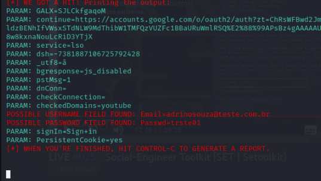

# cibersecurity-desafio-phishing

# Ferramentas
Kali Linux
setoolkit

# Configurando o Phishing no Kali Linux
Acesso root: sudo su
Iniciando o setoolkit: setoolkit
Vetor de ataque: Web Site Attack Vectors
Método de ataque: Credential Harvester Attack Method
Método de ataque: Site Tamplate

Obtendo o endereço da máquina: ifconfig
Clone : google.com
# Resutados

